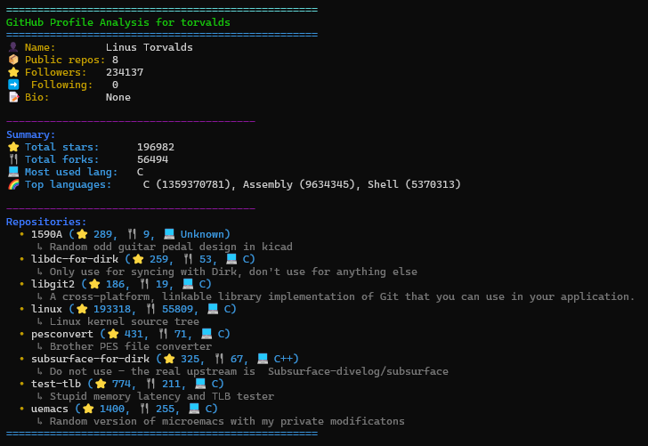

# GitHub Profile Analyzer

A modern, visually appealing command-line tool to analyze any public GitHub user's profile and repositories.

## Features
- Fetches and displays GitHub user profile info (name, followers, bio, etc.)
- Summarizes repository stats (total stars, forks, most used languages)
- Shows top 3 languages used
- Beautiful, colorized console output
- Export results to JSON, CSV, or Markdown
- Handles API rate limits and errors gracefully
- Easy to use and extend

## Setup

1. **Clone the repository:**
   ```sh
   git clone https://github.com/yourusername/github-profile-analyzer.git
   cd github-profile-analyzer
   ```

2. **Install dependencies:**
   ```sh
   pip install -r requirements.txt
   ```

3. **(Optional but recommended) Add a GitHub token:**
   - Create a `.env` file in the project root:
     ```
     GITHUB_TOKEN=your_github_token_here
     ```
   - [Generate a token here](https://github.com/settings/tokens) (no scopes needed for public data).
   - **Security Note:** _You will **never** be asked to enter your token in the terminal. The tool only uses the token if it is present in your `.env` file or as an environment variable. Your token is never uploaded or shared._

## Usage

Analyze a GitHub user in the console:
```sh
python main.py <github-username>
```

Show more details (URLs, etc.):
```sh
python main.py <github-username> --verbose
```

Export to JSON, CSV, or Markdown:
```sh
python main.py <github-username> --format json --output result.json
python main.py <github-username> --format csv --output repos.csv
python main.py <github-username> --format md --output report.md
```

> **Note:** If you do not provide a token, the tool will still work for public data, but with lower rate limits (60 requests/hour per IP). For best results, add your own token to `.env`.

## Example Output



## Contributing
Pull requests are welcome! For major changes, please open an issue first to discuss what you would like to change.

## License
[MIT](LICENSE) 